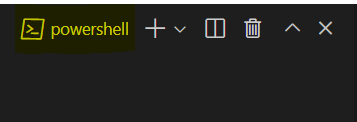
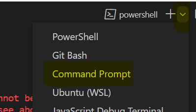

# Scrypto Tutorial
This tutorial will teach you the basics of Scrypto, the smart contract programming language of Radix. Here is a summary of what you will learn:

|  Example                  |    What you will learn                                                                    |
|---------------------------|-------------------------------------------------------------------------------------------|
| Hello World               | The basic structure, how to create a token and how to write methods.                      |
| Gumball Machine           | How to parameterize your components and accept a payment.                                 |
| Bored Gumball Club NFTs   | How to create NFTs and mint resources.                                                    |
| Event Ticket System       | Creating more complex NFTs                                                                |
| RadiSwap                  | Learn to build a more concrete example and use the transaction manifest to compose calls. |

## Running the examples
Before running the examples, you will need to install the [Scrypto toolchain](https://docs.radixdlt.com/main/scrypto/getting-started/install-scrypto.html) and an IDE that supports Rust. We recommend using [VS Code](https://code.visualstudio.com/) with the [rust-analyzer extension](https://marketplace.visualstudio.com/items?itemName=rust-lang.rust-analyzer).

## Running on Windows
If you are testing the examples on Windows, make sure to open a **PowerShell** terminal in VSCode by selecting in the menus: Terminal > New Terminal, and then making sure that this is a PowerShell terminal by looking at the top right: 

If you see something other than `powershell`, click on the arrow and then `PowerShell`:

Finally, to run our `ps1` scripts, you need to allow PowerShell to run external script by running this command: `Set-ExecutionPolicy -ExecutionPolicy RemoteSigned -Scope Process`

## Getting syntax highlighting in TX manifests
To enable syntax highlighting in the transaction manifest files you can right-click the `rtm_color.vsix` file and select `Install extension VSIX`.